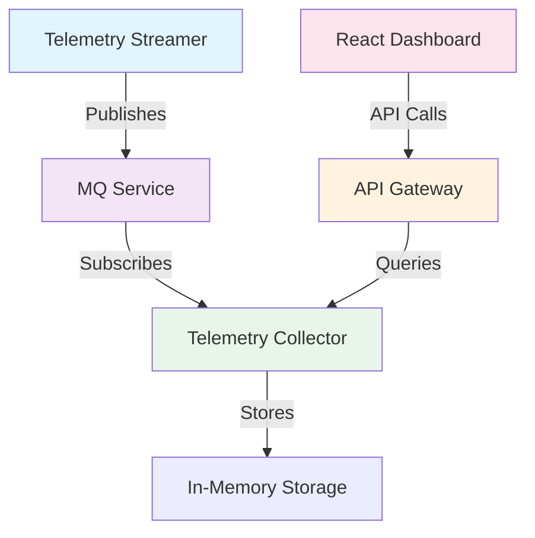

# GPU Telemetry Pipeline

Real-time GPU monitoring system with microservices architecture, built-in message queue, and React dashboard.

## 🚀 Quick Start

```bash
# Clone and start all services
git clone <repository-url> && cd telemetry-pipeline
make docker-up

# Or run locally  
make install && make run

# Access dashboard: http://localhost:3000
# API docs: http://localhost:8081/swagger/
```

## 📋 Components

| Service | Purpose | Port | Endpoints |
|---------|---------|------|-----------|
| **API Gateway** | REST API & service coordination | 8081 | `/api/v1/gpus`, `/api/v1/hosts`, `/health`, `/swagger/` |
| **MQ Service** | Message routing & queuing | 9090/9091 | `/publish/{topic}`, `/health`, `/stats` |
| **Telemetry Collector** | Data processing & storage | 9090 | `/health` |
| **Telemetry Streamer** | CSV data ingestion | - | Publishes to MQ |
| **React Dashboard** | Visualization interface | 3000 | Web UI |

## 🏗️ Architecture



## 🛠️ Technology Stack

- **Backend**: Go 1.24+ with Gorilla Mux, gRPC, Protocol Buffers
- **Frontend**: React 19 + TypeScript + Vite  
- **Message Queue**: Built-in broker with persistence
- **Deployment**: Docker Compose, Kubernetes + Helm

## 📈 Key Features

- **Real-time GPU monitoring** with WebSocket streaming
- **High throughput** (10,000+ messages/second per worker)
- **Production-ready** with health checks and graceful shutdown
- **Scalable architecture** with configurable workers
- **Interactive dashboard** with historical data visualization

## 🔧 Development

```bash
make dev          # Start development mode with hot reload
make test         # Run test suite
make lint         # Code quality checks  
make build        # Build production binaries
```

## 📚 Documentation

- **[🚀 Quick Start](docs/quickstart/README.md)** - Setup and installation
- **[🏗️ Architecture](docs/architecture/README.md)** - System design details  
- **[⚙️ Components](docs/components/README.md)** - Service specifications
- **[🚀 Deployment](docs/deployment/README.md)** - Production deployment
- **[🔧 Makefile](docs/makefile.md)** - Development commands

---

**[📖 Full Documentation](docs/) | [🐛 Issues](../../issues) | [🤝 Contributing](docs/quickstart/README.md#development-setup)**