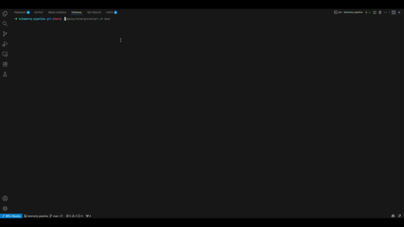
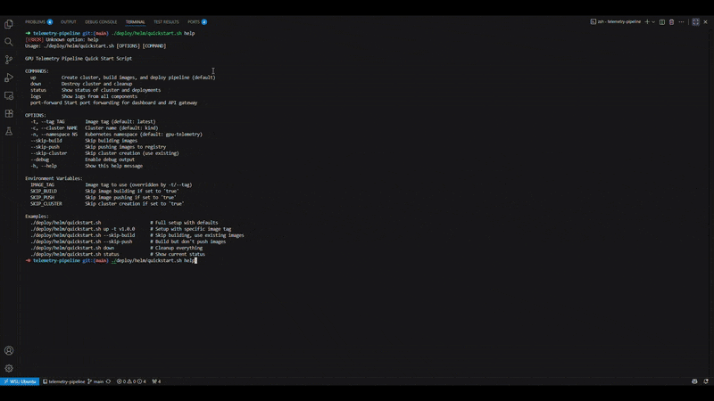
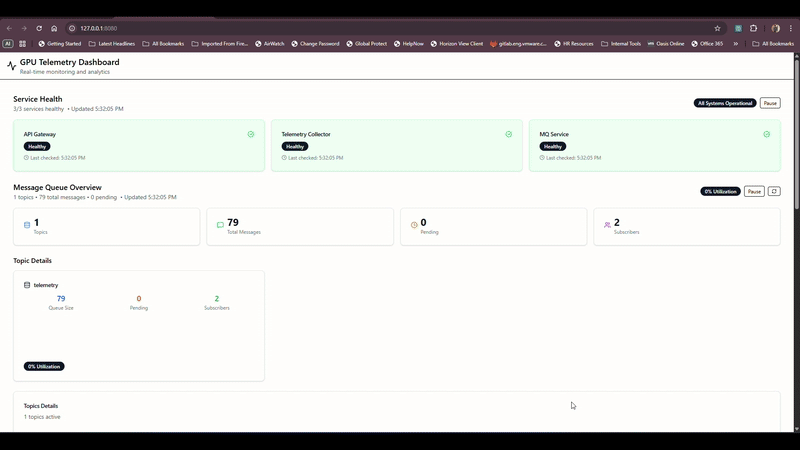

# GPU Telemetry Pipeline

[](https://opensource.org/licenses/MIT)
[](https://golang.org/)
[](https://www.docker.com/)
[](https://kubernetes.io/)

A production-ready, scalable telemetry pipeline for GPU metrics built with Go. Streams GPU telemetry data through a custom message broker to persistent collectors with real-time monitoring via React dashboard.

## 🚀 Quick Start

### With Docker (5 minutes)

```bash
git clone https://github.com/harishb93/telemetry-pipeline.git
cd telemetry-pipeline/deploy/docker
./setup.sh
```

Open [http://localhost:5173](http://localhost:5173) to view the dashboard.

### With Kubernetes(Kind) (10 minutes)

```bash
git clone https://github.com/harishb93/telemetry-pipeline.git
cd telemetry-pipeline/deploy/helm
./quickstart.sh
```







See [Quickstart Guide](docs/quickstart/README.md) for detailed setup instructions.

---

## 📋 Documentation

Comprehensive documentation is organized into focused guides:

### Getting Started
- **[Quickstart Guide](docs/quickstart/README.md)** - Get running in minutes
  - Docker Compose setup
  - Kubernetes (Kind) setup  
  - Verification & testing
  - Troubleshooting

### Understanding the System
- **[System Architecture](docs/architecture/README.md)** - How it all works
  - High-level overview
  - Component interactions
  - Data flow diagrams
  - Scalability strategies
  - Design decisions

- **[Components Reference](docs/components/README.md)** - What each service does
  - Telemetry Streamer
  - Custom Message Queue
  - Telemetry Collector
  - API Gateway
  - React Dashboard

### Deployment & Operations
- **[Deployment Guide](docs/deployment/README.md)** - Deploy to any environment
  - Docker Compose deployment
  - Kubernetes deployment
  - Helm configuration
  - Production hardening
  - Advanced patterns (multi-cluster, GitOps, etc.)

- **[Makefile Guide](docs/makefile.md)** - Build and deployment automation
  - Build targets
  - Docker targets
  - Kubernetes targets
  - Common workflows
  - Troubleshooting

## 📊 Components

| Component | Purpose | Technology | Scaling |
|-----------|---------|-----------|---------|
| **Streamer** | Publish CSV data to MQ | Go, goroutines | Horizontal (multiple instances) |
| **Message Queue** | Route messages reliably | Custom Go implementation | Horizontal (stateless) |
| **Collector** | Consume & persist data | Go, worker pool | Horizontal (independent consumers) |
| **API Gateway** | Unified REST API | Go, Gorilla mux | Horizontal (stateless) |
| **Dashboard** | Real-time monitoring | React 19, Vite | Horizontal (stateless frontend) |

See [Components Reference](docs/components/README.md) for detailed information on each component.

## 🏗️ High-Level Architecture


## 🚀 Key Features

### Telemetry Streamer
- **Flexible CSV Processing**: Schema-agnostic parsing with automatic type detection
- **Continuous Streaming**: Loops through data with configurable rates
- **Concurrent Workers**: Multiple workers with independent rate limiting
- **Type Conversion**: Automatic string-to-number conversion for metrics
- **Graceful Shutdown**: Signal-based cleanup with proper resource management

### Custom Message Queue
- **Custom Implementation**: No external dependencies (Kafka, RabbitMQ, Redis, etc.)
- **Acknowledgment Semantics**: Message acknowledgment with timeout and redelivery
- **Persistence Layer**: Disk persistence for message durability
- **Admin Endpoints**: HTTP APIs for monitoring queue stats and health
- **Concurrency Safe**: Thread-safe operations with proper locking

### Telemetry Collector
- **Typed Data Structures**: JSON parsing to strongly-typed Go structs
- **Dual Persistence**: Both file-based (JSONL) and in-memory (LRU) storage
- **Checkpoint System**: Processing state persistence for recovery
- **Worker Pool**: Configurable concurrent message processing
- **Health Monitoring**: HTTP endpoints for health checks and statistics

### Observability & Operations
- **Health Endpoints**: Comprehensive health checks for all components
- **Graceful Shutdown**: Proper cleanup on SIGINT/SIGTERM signals
- **Checkpointing**: Processing state persistence for fault tolerance

## 🛠️ Technology Stack

- **Backend**: Go 1.24+ with Gorilla Mux, gRPC, Protocol Buffers
- **Frontend**: React 19 + TypeScript + Vite  
- **Message Queue**: Built-in broker with persistence
- **Deployment**: Docker Compose, Kubernetes + Helm

## 🚀 CI/CD Pipeline

### Automated Quality Assurance
Our CI/CD pipeline runs on **every branch** and **every pull request** to ensure code quality:

- **✅ Continuous Integration**: Automated testing, linting, and building on all branches
- **🔒 Security Analysis**: CodeQL security scanning and vulnerability checks
- **📊 Code Coverage**: Automatic coverage reporting with Codecov integration
- **🏗️ Multi-Environment Testing**: Unit tests, integration tests, and Docker builds
- **📚 Documentation**: Automatic API documentation generation
- **🐳 Container Testing**: Docker image building and validation

### Pipeline Stages
1. **Unit & Integration Tests** - Comprehensive test suite with coverage reporting
2. **Code Quality Checks** - Linting, formatting, and static analysis
3. **Security Scanning** - CodeQL analysis and vulnerability detection
4. **Docker Build** - Container image creation and validation
5. **Documentation** - API docs generation and validation

### Quality Gates
- ✅ All tests must pass
- ✅ Code coverage maintained
- ✅ No security vulnerabilities
- ✅ Docker builds successful
- ✅ Linting and formatting checks pass

> **Note**: The CI pipeline now runs on **all branches**, not just main and develop. This ensures early feedback on feature branches and comprehensive testing across the entire development workflow.

## 🚀 Setup Teardown

For Docker

```bash
cd telemetry-pipeline/deploy/docker
./setup.sh -d
```
For Kubernetes

```bash
cd telemetry-pipeline/deploy/helm
./quickstart.sh down
```

## Known Issues/Constraints
1. This project doesn't use any open source tools or storage options like Redis/PostGres. Fetching stats across pods through file storage is inefficient and inconsistent
2. MQ Service is not Load-Balanced - Scaling would send requests to MQ Service in a round-robin fashion
3. No Aggregated Stats Endpoint for MQ

## Next Steps(Design Considerations)

1. Add a REDIS layer to aggregate stats for MQ pods
2. Implement Aggregated Stats Endpoint for MQ Service using the REDIS

## 🤝 Contributing

1. Fork the repository
2. Create a feature branch
3. Add tests for new functionality
4. Ensure all tests pass: `go test ./...`
5. Submit a pull request