# System Architecture

## Overview

The GPU Telemetry Pipeline is a modern, production-ready system that streams GPU metrics through a custom message broker to persistent collectors. The architecture follows the pattern: **CSV Streamers → Custom MQ → Collectors → Storage**.

### Design Philosophy

- **Simplicity**: No external dependencies for core functionality
- **Scalability**: Horizontally scalable components with independent scaling
- **Observability**: Built-in health checks and metrics at every layer
- **Fault Tolerance**: Graceful handling of failures with recovery mechanisms

---

## High-Level System Architecture

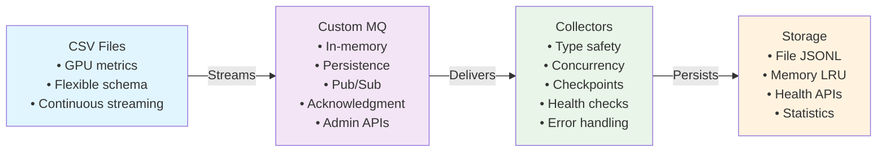

---

## Component Architecture

### 1. Telemetry Streamer

**Purpose**: Reads GPU telemetry data from CSV files and publishes to the message queue.

**Key Characteristics**:
- Schema-agnostic CSV parsing (works with any CSV format)
- Concurrent workers for parallel data streaming
- Configurable message rate per worker
- Continuous loop with graceful shutdown support

**Data Flow**:

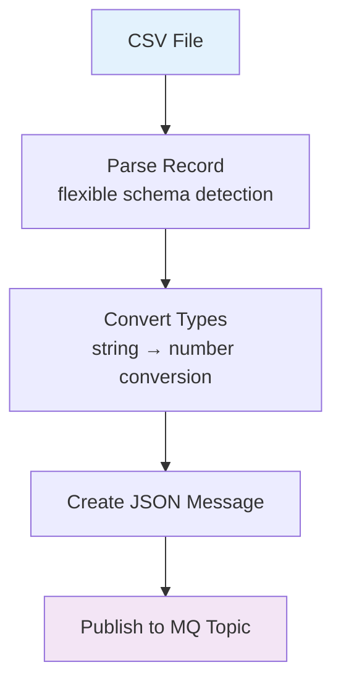

**Scalability**:
- Multiple streamer instances can run in parallel
- Each instance has independent worker pools
- Rate limiting per worker prevents queue saturation

---

### 2. Custom Message Queue (MQ)

**Purpose**: In-memory message broker with optional persistence for reliable message delivery.

**Architecture**:

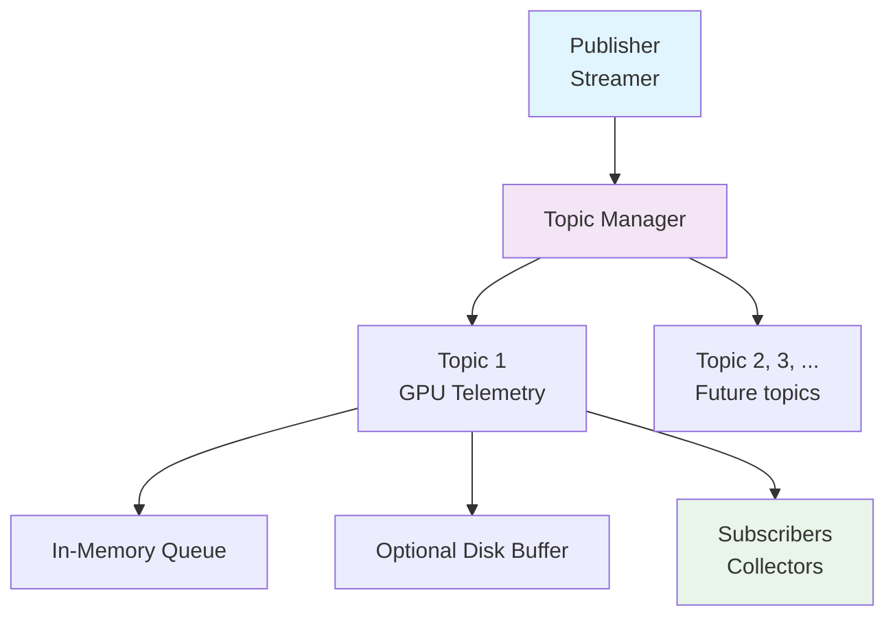

**Key Features**:
- **In-Memory Storage**: Optional High-performance message queue in RAM
- **Message Acknowledgment**: Ensures delivery reliability
  - Message is held until acknowledged by subscriber
  - Automatic redelivery on timeout (5s default)
  - Prevents message loss with retry mechanism
- **Topic-Based Routing**: Subscribers receive messages from specific topics
- **Persistence Layer**: Disk persistence for durability(default)
- **Admin Endpoints**: Real-time statistics and health monitoring

**Message Lifecycle**:

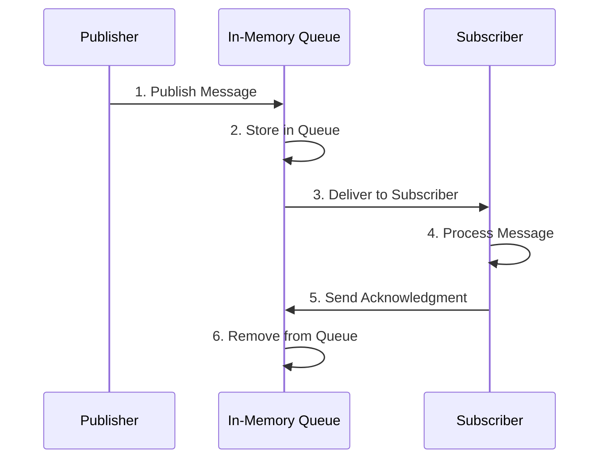

**Reliability Guarantees**:
- At-least-once delivery (messages redelivered until acknowledged)
- Configurable timeout and retry settings
- Optional persistence for zero-message-loss scenarios

---

### 3. Telemetry Collector

**Purpose**: Consumes telemetry messages and provides dual-layer storage with querying capabilities.

**Architecture**:

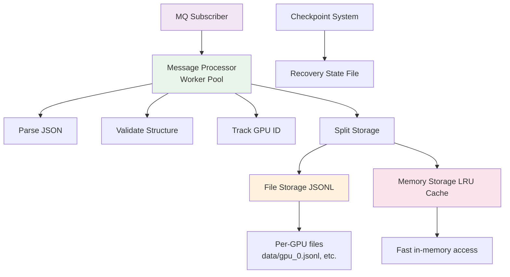

**Dual Storage Strategy**:

| Storage | Purpose | Benefits |
|---------|---------|----------|
| **File Storage (JSONL)** | Long-term persistence | Durable, searchable, auditable |
| **Memory Storage (LRU)** | Real-time queries | Fast access, reduced disk I/O |

**Scalability**:
- Configurable worker pool for concurrent message processing
- LRU cache with configurable max entries per GPU
- Automatic cache eviction prevents memory exhaustion
- Per-GPU file sharding enables parallel I/O

---

## Data Flow Diagrams

### Real-Time Data Pipeline

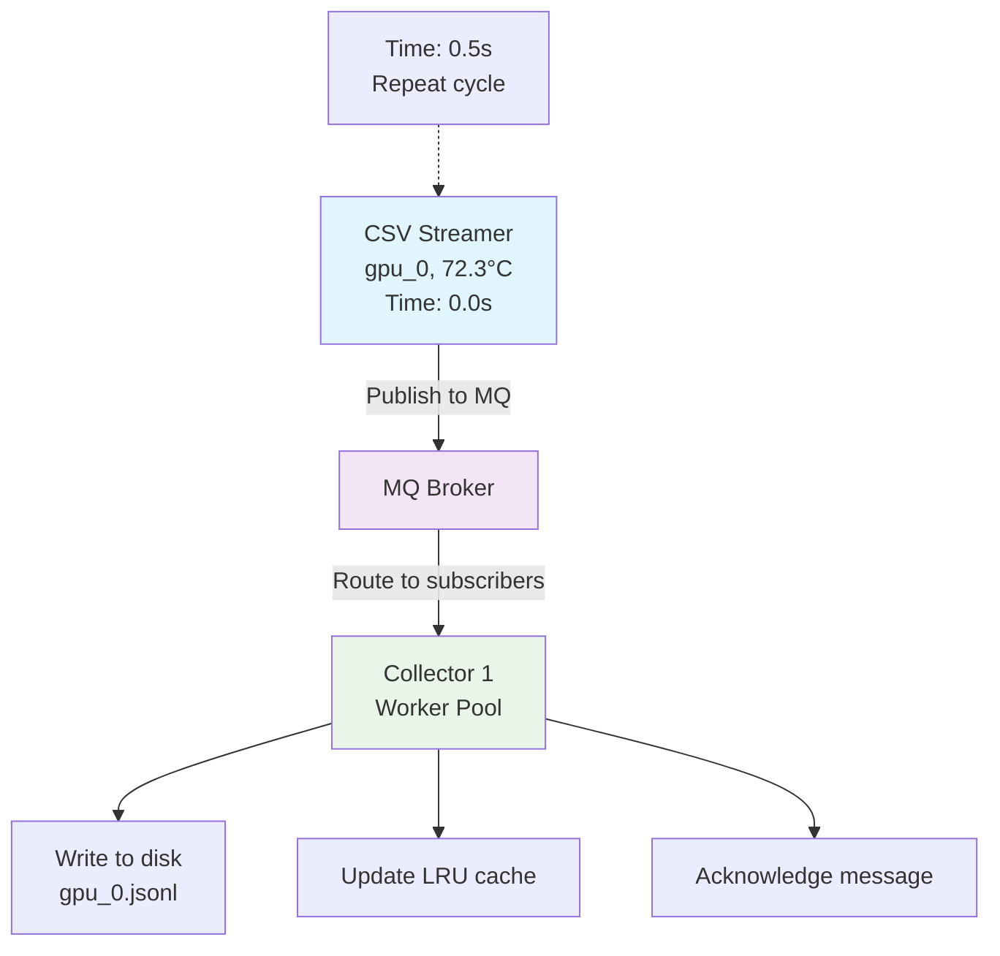

### Message Processing Sequence

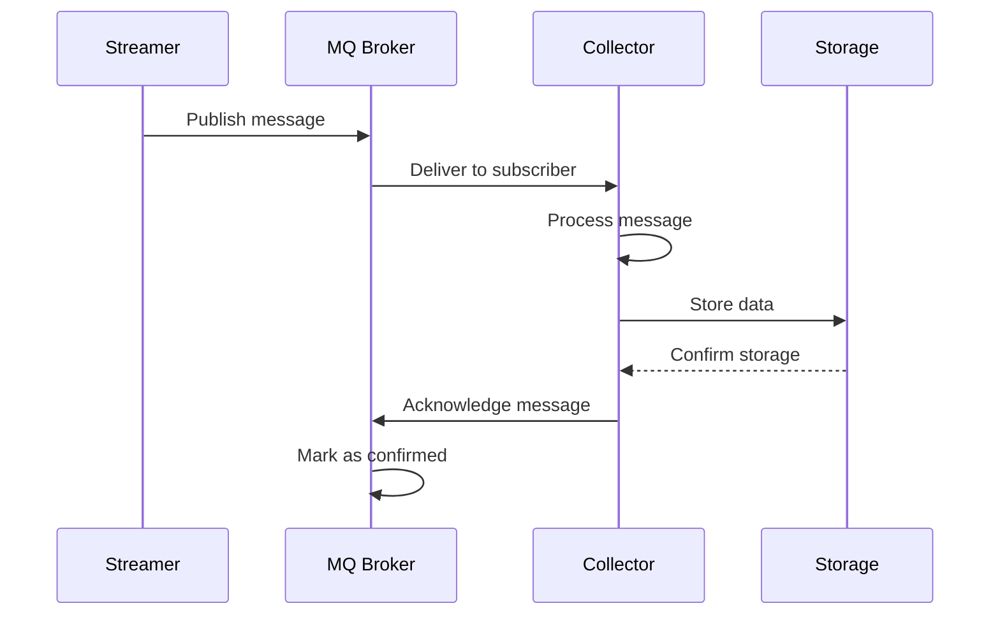

---

## API Architecture

### Health & Monitoring

**API Gateway Health Endpoint** (`GET /health`):
```json
{
  "status": "healthy",
  "service": "telemetry-api-gateway",
  "timestamp": "2025-10-20T12:00:00Z",
  "version": "1.0.0",
  "collector": {
    "status": "healthy"
  }
}
```

**Service Health Aggregation**:
- API Gateway monitors all downstream services
- Single health check endpoint for all services
- Real-time status reflecting actual service state

### Data Access APIs

**API Gateway (Port 8081)**:
- **GPU List**: `GET /api/v1/gpus`
- **GPU Telemetry**: `GET /api/v1/gpus/{id}/telemetry`
- **Host List**: `GET /api/v1/hosts`
- **Host GPUs**: `GET /api/v1/hosts/{hostname}/gpus`
- **Health Status**: `GET /health`
- **API Documentation**: `GET /swagger/`

**MQ Service (Port 9090/9091)**:
- **Publish Message**: `POST /publish/{topic}`
- **Broker Stats**: `GET /stats`
- **Health Status**: `GET /health`
- **gRPC Interface**: Port 9091

---

## Deployment Patterns

### Single Machine (Development)

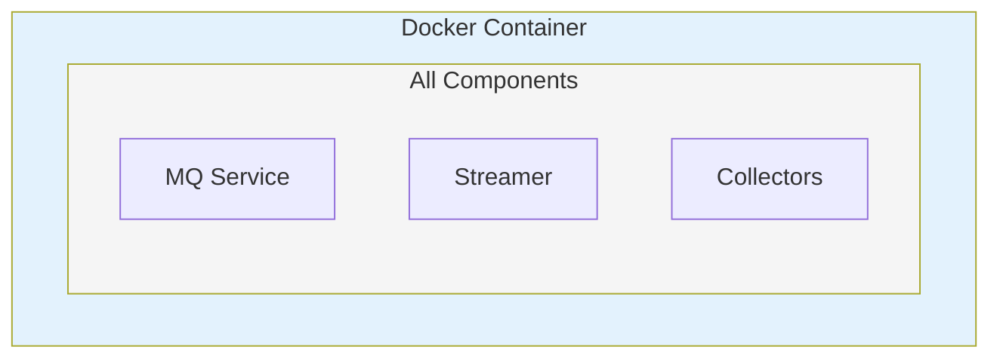

### Kubernetes (Production)

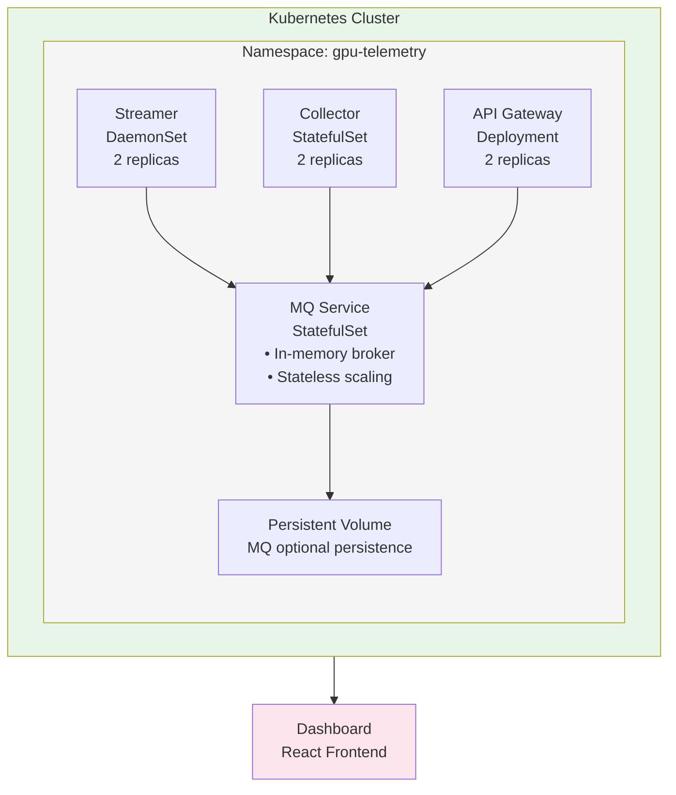

---

## Concurrency Model

### Worker Pool Pattern

Each component uses a configurable worker pool for concurrent processing:

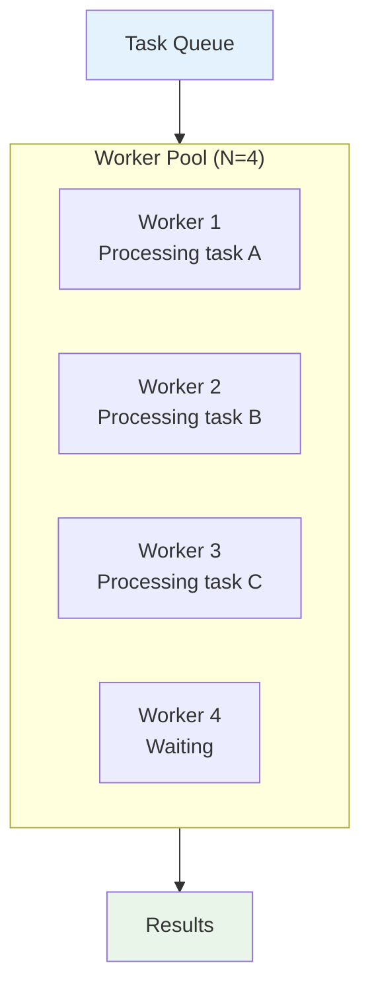

**Benefits**:
- CPU parallelism on multi-core systems
- I/O concurrency without blocking
- Configurable throughput via worker count
- Graceful scaling based on workload

---

## Error Handling & Recovery

### Circuit Pattern

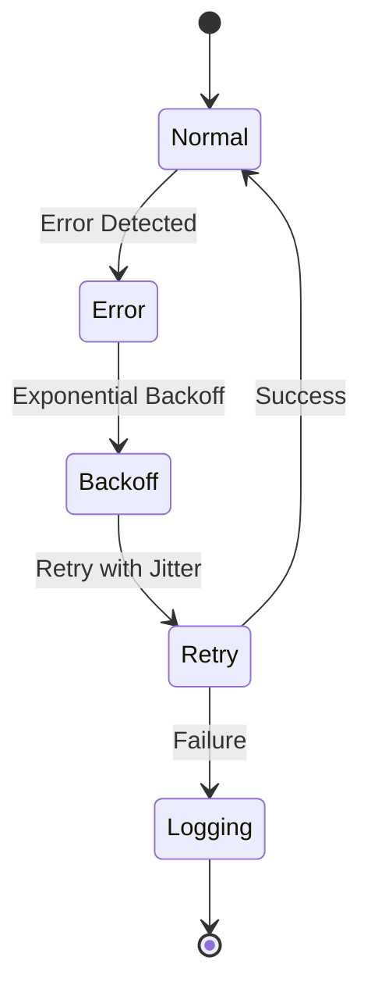

### Graceful Shutdown

All components support clean shutdown on `SIGINT`/`SIGTERM`:

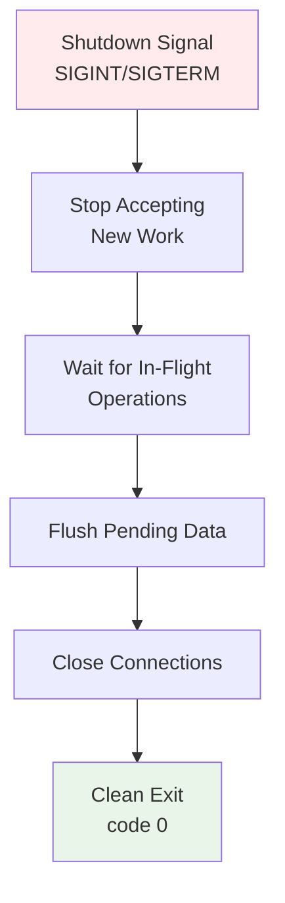

---

## Performance Characteristics

### Throughput

- **Streamer**: 1000+ messages/second per worker
- **MQ Broker**: 10,000+ messages/second in-memory
- **Collector**: 500+ messages/second per worker

### Latency

- **Message Queue**: < 1ms end-to-end latency
- **File Persistence**: ~5-10ms per message
- **Cache Lookup**: < 1ms for LRU hits

### Resource Usage

- **Memory**: Configurable via LRU cache size
- **CPU**: Scales with worker count
- **Disk**: Dependent on telemetry volume and retention

---

## Scalability Strategies

### Horizontal Scaling

- **Multiple Streamers**: Partition CSV files across instances
- **Multiple Collectors**: MQ distributes load across subscribers
- **Multiple API Gateway**: Load-balance across API instances

### Vertical Scaling

- **Increase Workers**: Adjust worker pool size per component
- **Increase Cache**: Grow LRU cache for more telemetry retention
- **Increase Throughput**: Adjust message rate per worker

### Adaptive Scaling

- Kubernetes HPA automatically scales based on CPU/memory
- MQ handles bursty traffic without client coordination
- Collectors independently process at their own rate

---

## Design Decisions

### Why Custom MQ?

1. **Single Binary Deployment**: No Kafka, RabbitMQ, or Zookeeper needed
2. **Optimized for Telemetry**: Tailored acknowledgment and redelivery
3. **Observable**: Built-in metrics and admin endpoints
4. **Customizable**: Message routing and persistence strategies

### Why Dual Storage?

1. **Performance**: In-memory cache for real-time queries
2. **Durability**: File storage for long-term retention
3. **Cost**: LRU eviction prevents unbounded memory growth
4. **Flexibility**: Different access patterns for different use cases

### Why Kubernetes DaemonSet for Streamer?

1. **Mimic Per-Node Processing**: Collect telemetry from node where GPU resides
2. **Auto-Scaling**: Streamer runs on every node automatically
3. **Resilience**: Node failure doesn't stop entire pipeline
4. **Resource Awareness**: Streamer respects node capacity

---

## Next Steps

- See [Quickstart Guide](../quickstart/README.md) for deployment instructions
- See [Components Documentation](../components/README.md) for detailed component info
- See [Deployment Guide](../deployment/README.md) for production setup
